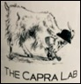

# Welcome to the Capra Lab!
{: .display-4}
 
Evolutionary and Computational Genomics at UCSF
{: .welcomefont}

{:style="max-width: 100%; height: auto;"}

We use the tools of computer science and statistics to address problems in genetics, evolution, and biomedicine. For a summary of our major research foci, see Research.

Our group is located in the Bakar Computational Health Sciences Institute and the Department of Epidemiology and Biostatistics at the University of California, San Francisco. Prior to coming to UCSF, I spent 7 wonderful years at Vanderbilt University.

Humans differ from one another and our closest living relatives, the chimpanzees, in a wide range of traits, including our susceptibility to many diseases. We model the evolutionary processes that have produced these novel traits and develop algorithms that compare genomes to predict the functional relevance of specific genetic differences between individuals and species.
{: .welcomefont}

We are located in the Bakar Computational Health Sciences Institute and Department of Epidemiology and Biostatistics at UCSF!
{: .welcomefont}
